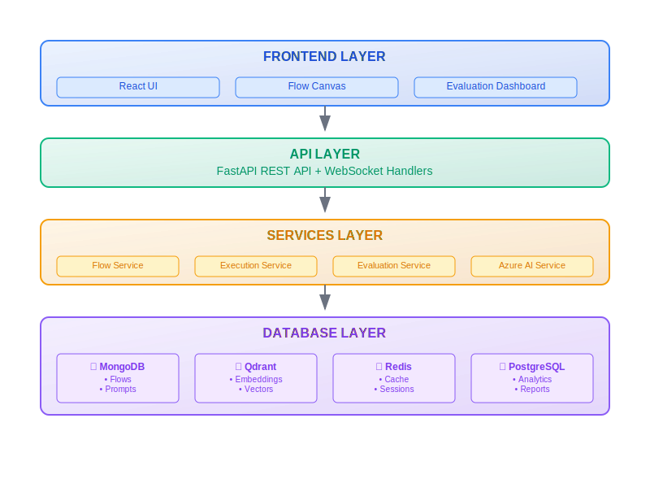

# Documentation

This directory contains documentation and visual assets for the Prompt Flow Application.

## Architecture Diagrams

### Viewing Diagrams

The SVG diagrams in this repository will render automatically in:
- ✅ GitHub (in README and documentation)
- ✅ GitLab 
- ✅ VS Code (with SVG preview extension)
- ✅ Any modern web browser
- ✅ Most Markdown editors

### Available Diagrams

1. **System Architecture** (`diagrams/system-architecture.svg`)
   - Complete system overview
   - Layer-by-layer breakdown
   - Technology stack visualization

2. **A/B Testing Flow** (`diagrams/ab-testing-flow.svg`)
   - Experiment workflow
   - Traffic routing logic
   - Statistical analysis process

### Creating New Diagrams

#### Option 1: SVG (Recommended)
Create SVG files for scalable, crisp diagrams that work everywhere:

```svg
<svg width="400" height="300" xmlns="http://www.w3.org/2000/svg">
  <!-- Your diagram content -->
</svg>
```

**Benefits:**
- ✅ Renders in all browsers and GitHub
- ✅ Scalable without quality loss
- ✅ Small file sizes
- ✅ Can include interactive elements

#### Option 2: Online Diagram Tools

Use these tools to create diagrams, then export as SVG or PNG:

1. **Draw.io / diagrams.net** (Free)
   - URL: https://app.diagrams.net/
   - Export as SVG for best results
   - Great for system architecture diagrams

2. **Lucidchart** (Paid/Free tier)
   - Professional diagramming tool
   - Excellent templates
   - Team collaboration features

3. **Figma** (Free/Paid)
   - Design-focused tool
   - Great for UI mockups and flows
   - Export as SVG

4. **Excalidraw** (Free)
   - URL: https://excalidraw.com/
   - Hand-drawn style diagrams
   - Export as SVG

#### Option 3: Code-Generated Diagrams

Generate diagrams from code using these tools:

1. **PlantUML**
   ```plantuml
   @startuml
   actor User
   User -> System : Request
   System -> Database : Query
   @enduml
   ```

2. **D3.js** (For interactive diagrams)
   ```javascript
   // Create dynamic, interactive SVG diagrams
   ```

### Embedding Diagrams

#### In Markdown:
```markdown
<!-- SVG (recommended) -->


<!-- PNG (fallback) -->


<!-- HTML for more control -->
<div align="center">
  
</div>
```

#### In HTML/React:
```jsx
// Direct embed


// With styling
<div className="diagram-container">
  
</div>
```

### Best Practices

1. **File Naming**
   - Use kebab-case: `system-architecture.svg`
   - Be descriptive: `a-b-testing-workflow.svg`

2. **SVG Optimization**
   - Use viewBox for responsiveness
   - Include alt text for accessibility
   - Keep file sizes reasonable

3. **Colors**
   - Use consistent color scheme
   - Ensure good contrast
   - Consider dark/light mode compatibility

4. **Documentation**
   - Always include alt text
   - Add captions explaining the diagram
   - Link to relevant sections

### Troubleshooting

**SVG not rendering?**
- Check file syntax with an SVG validator
- Ensure proper XML declaration
- Verify file encoding (UTF-8)

**Need to edit existing diagrams?**
- SVG files can be edited in:
  - Inkscape (free)
  - Adobe Illustrator
  - Code editor (for simple changes)
  - Online SVG editors

**Want interactive diagrams?**
- Consider React components with SVG
- Use libraries like D3.js or vis.js
- Embed interactive tools like Observable notebooks
